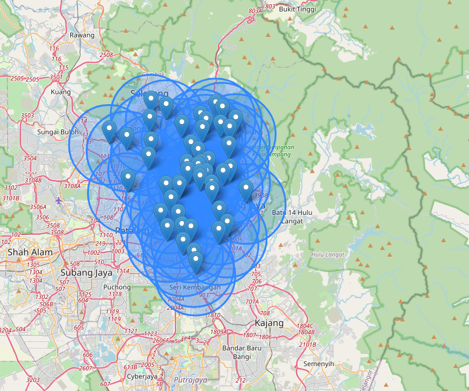

# 🍟 Outlet-Navigator

This project is a full-stack web application that scrapes McDonald's outlet data in Kuala Lumpur from the official website and provides:

- ✅ Automated web scraping using Playwright
- ✅ Structured data parsing with BeautifulSoup
- ✅ Backend API with FastAPI & SQLite
- ✅ Interactive map frontend with Leaflet.js
- ✅ Chatbot-ready filtering layer

> Frontend Map Preview


---

## 📦 Project Structure
```
Outlet-Navigator/
├── scraper/           # Scraping logic, parser, and service
├── api/               # FastAPI backend with CORS
├── database/          # SQLAlchemy DB setup
├── frontend/          # HTML + Leaflet map
├── chatbot/           # Query mock layer
├── main.py            # Run scraper + populate DB
├── requirements.txt   # Dependencies
├── Dockerfile         # Docker container for API + scraper
├── docker-compose.yml # Compose to run API and scraper
└── README.md          # You're here :)
```

---

## 🐳 Dockerized Setup

### 1. Build & Run
```bash
docker-compose up --build
```
This will:
- Run the scraper and populate `outlets.db`
- Start FastAPI at `http://localhost:8000`

### 2. Open the frontend
Open `frontend/index.html` manually in a browser (it reads from the backend API).

---
## 🧠 Chatbot Query
You can integrate with a chatbot using `chatbot/mock.py`. It supports simple rules:
```python
answer_query("Which outlets are open 24 hours?", outlet_data)
answer_query("birthday", outlet_data)
```
---
## 📡 API Usage

### 🔍 Get all outlets
```bash
curl http://localhost:8000/outlets
```
Returns JSON list of all McDonald's outlets scraped from Kuala Lumpur.

---

## 🛠 Technologies Used
- **Playwright** for headless browser scraping
- **BeautifulSoup** for HTML parsing
- **SQLAlchemy** + **SQLite** for data persistence
- **FastAPI** for REST API
- **Leaflet.js** for frontend maps
- **Docker** + **Docker Compose** for containerized deployment

---

---

## 📄 License
MIT License © 2025 Hasan Mahmud Rhidoy

---